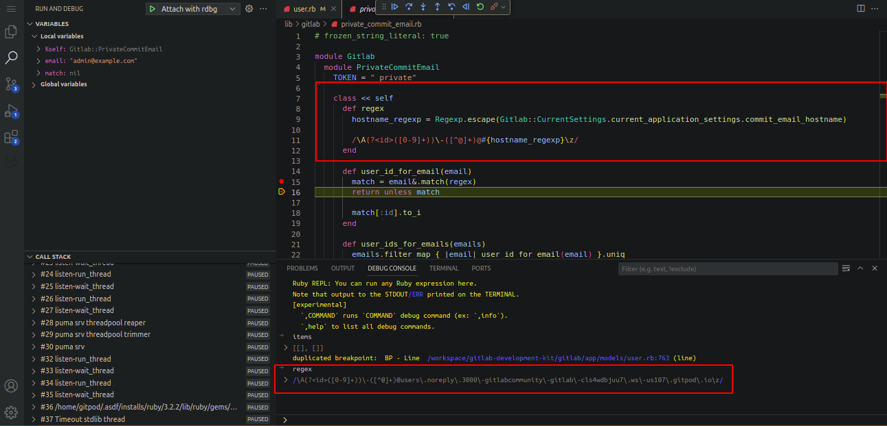
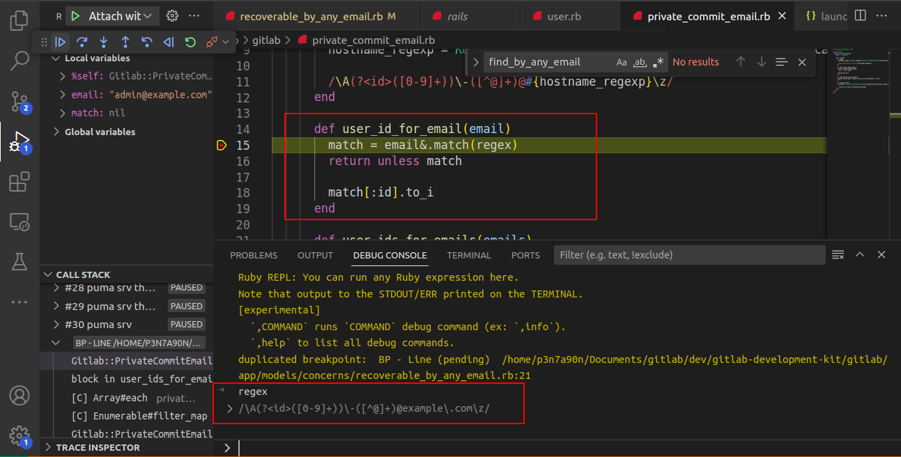
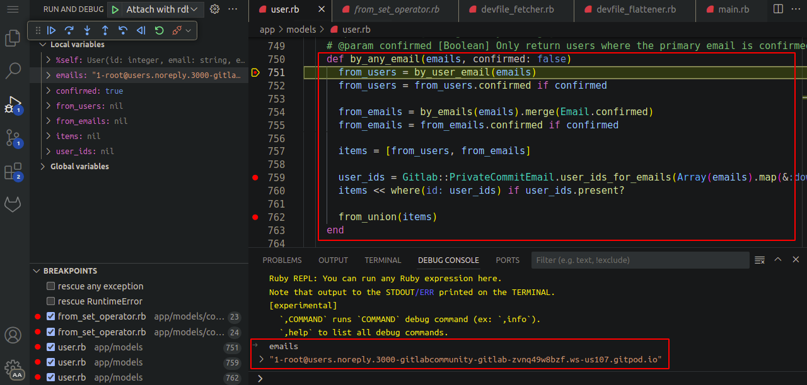
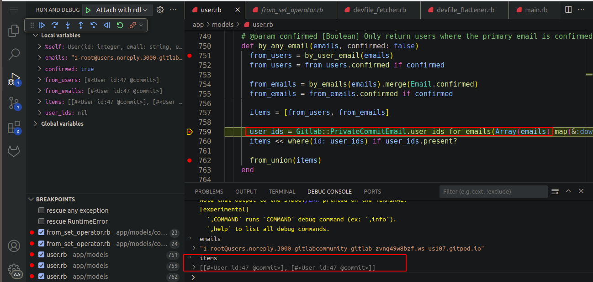
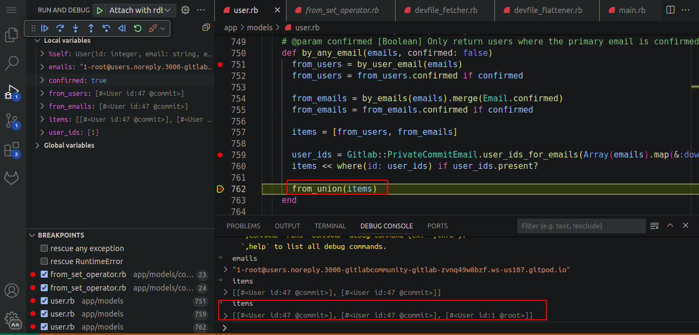
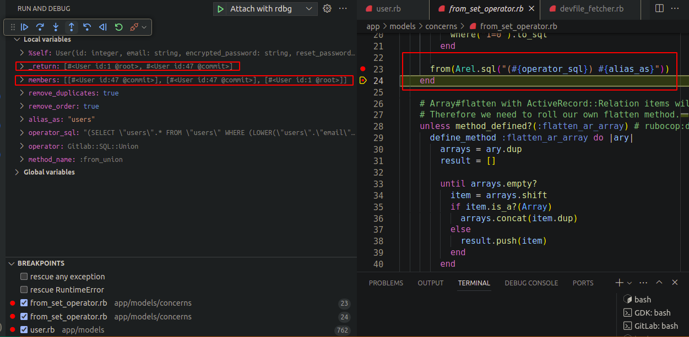
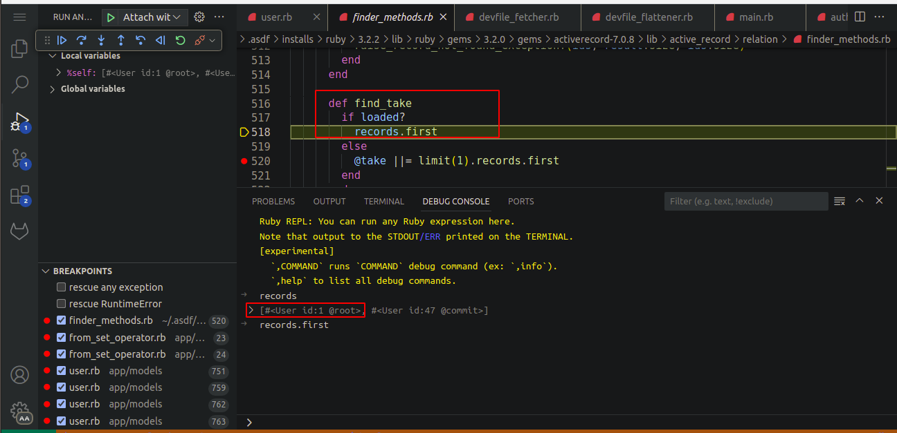
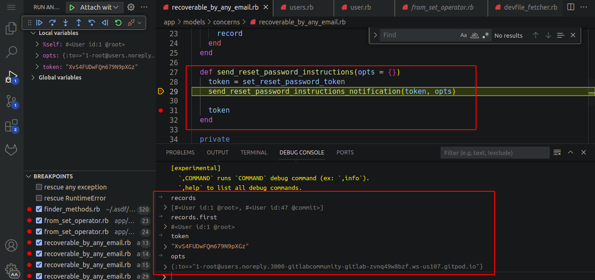
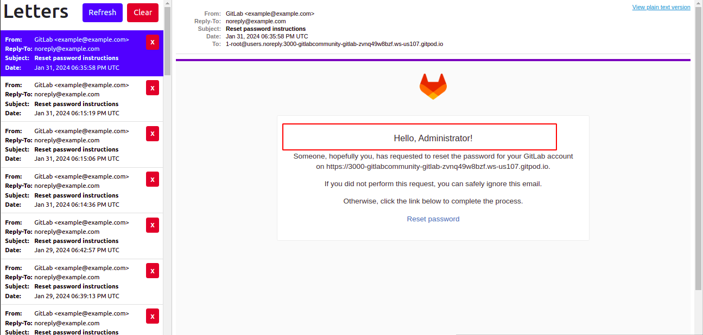

<head>
    <meta property="og:image" content=""/>
</head>
  <meta property="og:description" content="CVE-2023-7028" />
  <meta property="og:url" content="https://github.com/CVE-Reversing/CVE-Reversing/edit/main/Gitlab/CVE-2023-7028/README.md" />
  <meta property="og:image" content="https://raw.githubusercontent.com/CVE-Reversing/CVE-Reversing/33750cd934c8fff3a421a7b22d567d3e19b2f76d/Gitlab/CVE-2023-7028/Screenshots/og.png" />
  
# Reversing CVE-2023-7028 & Discovering Another Possible Account Takeover By Using Private Commit Email
<br>

In the security release of [11th Jan 2024](https://about.gitlab.com/releases/2024/01/11/critical-security-release-gitlab-16-7-2-released/#account-takeover-via-password-reset-without-user-interactions), Gitlab patched a critical vulnerability "Account Takeover via Password Reset without user interactions", for which CVE 2023-7028 was assigned.

This looked interesting, so we decided to look into the issue and the patch. This was our first time setting up the env and looking into the gitlab codebase.

While analyzing this CVE, we also discovered another issue that could potentially result in "Account Takeover on GitLab" based on certain criteria which is explained after the CVE analysis.

Below is the POC of CVE 2023-7028 that was used to take over any user account.


If you observe the screenshot, you'll see that the request is using `content-type` application/x-www-form-urlencoded, and within request, there's a parameter called user which contains an email address. Researcher added an extra [] which changed the email key from string type to list that contains multiple email addresses. So instead of just having the user's email like this:


The attacker changed it to:


Let's review the code to know how the above POC lead to account takeover of any user.

1. ActionController internal module is responsible for handling the controller request. It calls the method `create` of "password_controller.rb"


2. In the `create` method, `send_reset_password_instructions` method is getting called with post request body included as one of the fields in the "resource_params" parameter. Observe the debug console for the emails passed in the HTTP request body.


3. In the `send_reset_password_instructions` method, `attributes.delete` method extracts the `email` key from the `attributes` object passed as an argument and returns the list of emails supplied as shown below. `by_email_with_errors` method is called with the extracted email.


4. In this method, `by_email_with_errors` method is being called with the extracted emails.


5. In this method, it is again passing the emails to `find_by_any_email` method with a default parameter value `confirmed` set to `true` 


6. In this method, `by_any_email` method is getting called.


7. `by_user_email` method fetches the user records from the database if any user exists with the provided email address.


8. In the same manner, `by_emails` method fetched the user records based on the `emails` table with the join on `users` table in the database.


8. Now, the `user_id_for_emails` method fetches the user based on the private commit email(We will explain this later in detail)


9. `items` list will contain the user records from the methods: `by_any_email`, `by_emails`,`user_id_for_emails`.


10. Now the first record is fetched and will be used to generate the reset token


11. The reset password token of the user will be sent to all the emails supplied


## Possible Account Takeover of any user By Using Private Commit Email

### Video POC


https://github.com/CVE-Reversing/CVE-Reversing/assets/43419559/7ca1a5d3-d99a-47cf-b72d-dbbd003a37e1

We observed  the below code snippet.
https://gitlab.com/gitlab-org/gitlab/-/blob/d8c1bdad1cccaf9cf8f6c62af49907135b907b0e/app/models/user.rb#L750-763

```ruby
    def by_any_email(emails, confirmed: false)
      from_users = by_user_email(emails)
      from_users = from_users.confirmed if confirmed

      from_emails = by_emails(emails).merge(Email.confirmed)
      from_emails = from_emails.confirmed if confirmed

      items = [from_users, from_emails]

      user_ids = Gitlab::PrivateCommitEmail.user_ids_for_emails(Array(emails).map(&:downcase))
      items << where(id: user_ids) if user_ids.present?

      from_union(items)
    end
```
In this code, the PrivateCommitEmail method is called, which extracts the user ID from the private commit email and returns the user based on the extracted user ID. After extracting the user, it creates a password reset token for the extracted user and sends it to the private commit email instead of sending it to the user's registered email.

### Attack Scenarios

**Scenario 1:**
An attacker can takeover any other user account based on the user ID if they have obtained the mail in the private commit email format(<victimid>-<anything>@custom_hostname). In this case, attacker does not have to register the account on gitlab.

**Scenario 2:**
An attacker can register using the private commit email format (`<victimid>-<anything>@custom_hostname`) of any user. Subsequently, during the password reset process, the attacker will receive the reset password of the victim user.

By default, custom name is set to `users.noreply.<default_host>`. In this case, the attacker should have access to `<victimid><anything>@users.noreply.<default_host>`


If the admin has set a custom host, the attacker should then have access to  `<victimid><anything>@<custom_host>`. Here, the custom_host is set to "example.com"


There is a logic flaw in `Scenario 2` in the password reset email functionality. Below is an explanation for the same:

1. Observe that `by_user_email` and `by_emails` methods are called to fetch the user details based on the users and emails table from the database.


2. The list `items` contains the attacker's user records. After this, `PrivateCommitEmails.user_id_for_emails` is called, which fetches the record based on the victim ID supplied in the email, and there is a hostname check based on the below method.

```ruby
 def regex
        hostname_regexp = Regexp.escape(Gitlab::CurrentSettings.current_application_settings.commit_email_hostname)

        /\A(?<id>([0-9]+))\-([^@]+)@#{hostname_regexp}\z/
      end
```
3. Now, the list `items` contains the victim's User record as well.


4. Now, the union query is executed. Observe below that the list `items` and the return list from the query are in the same order, which is an ideal scenario. However, sometimes the list `items` and the return list from the query are in a different order.



5. First record is fetched which is the victim user and will be used to generate the reset token


6. After this, the reset password token of the victim user is sent to the attacker's email



#### CVE 2023-7028 Patch:

We observed that the above attack is not working in the latest version due to the patch introduced for CVE 2023-7028.  
Below is the code snippet that does not call the` by_email_with_errors` method, which has the support for private commit emails.
Email record is fetched from the `emails` table if the email exists in the database and then the user record is fetched based on the join on the `users` table.  
The supplied email is being converted into a string, so even adding support for multiple email addresses by using [] won't work.

```ruby
def send_reset_password_instructions(attributes = {})
      return super unless attributes[:email]

      email = Email.confirmed.find_by(email: attributes[:email].to_s)
      return super unless email

      recoverable = email.user

      recoverable.send_reset_password_instructions(to: email.email)
      recoverable
```

We reported this bug to gitlab on hackerone. It was marked as informative by gitlab since the patch for the CVE 2023-7028 also resolved this issue.

References:
- https://docs.gitlab.com/ee/administration/settings/email.html#custom-hostname-for-private-commit-emails
- https://gitpod.io/
